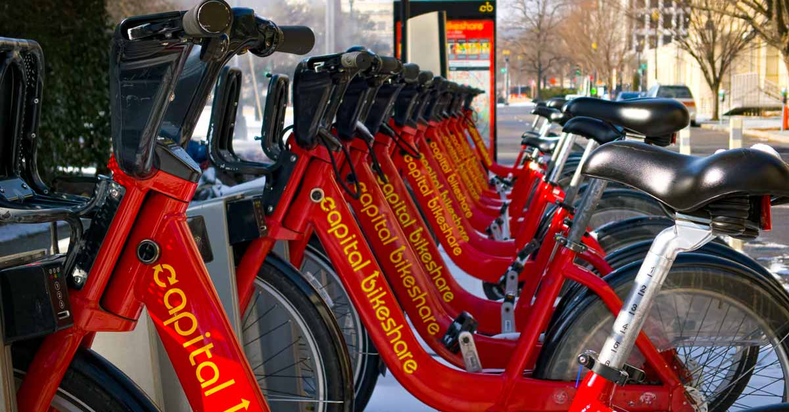

# Bike Rental Demand Prediction

  

## Resources
- 📑 [Presentation Deck](https://drive.google.com/file/d/1lV7zi2sNzPGAEh6G_sAeLIP1vt4TyuiL/view?usp=sharing)

## Project Overview
Bike-sharing systems in Washington, D.C. provide short-term transportation by allowing users to rent bicycles from one location and return them to another. This service supports convenient, healthy, and eco-friendly mobility.

As a **Data Scientist**, the objective of this project is to analyze bike rental patterns and build a predictive model to estimate demand, enabling better operational and strategic decision-making.

## Objectives
- Identify the best-performing machine learning model for demand prediction  
- Analyze key factors influencing bike rental demand and nderstand user behavior patterns  
- Provide recommendations to optimize operations  

## Model/Method
- Decision Tree  
- K-Nearest Neighbors (KNN)  
- Random Forest
- Gradient Boosting  

## Model Evaluation
- Metric: RMSLE (Root Mean Squared Log Error)  
- **Best Model: Random Forest**
  - Strong performance with lowest RMSLE  
  - Good generalization despite slight overfitting  
- Other models showed higher overfitting or lower accuracy  

## Key Insights
- **Seasonality:** Demand is higher during summer and fall, and drops significantly in winter.  
- **Time Patterns:** Peak demand occurs during commuting hours (7-9 AM & 4-7 PM).  
- **Weekly Trends:** High usage on weekdays and Saturdays, with a drop on Sundays.  
- **Weather Impact:** Clear weather drives high demand, while rain and snow significantly reduce usage.  
- **Usage Behavior:**  
  - Registered users dominate weekday commuting  
  - Casual users are more active on weekends (leisure usage)  

## Recommendations
- **Optimize Bike Availability:** Increase supply during peak hours and high-demand seasons, and adjust dynamically based on weather forecasts.  
- **Targeted Promotions:**  
  - Encourage off-peak usage with pricing incentives  
  - Tailor campaigns for casual vs registered users  
- **Demand-Based Operations:** Align bike distribution with commuting patterns and weekend leisure trends.  
- **Infrastructure Improvement:** Support long-term growth by improving bike lanes and accessibility to enhance user experience.  

## Output
- Predictive model for bike rental demand  
- Insights on user behavior and demand patterns  
- Data recommendations for operational optimization  
